# Bob IDE Guide for Newcomers

Welcome to Bob IDE! This guide explains the key concepts and features used in this project.

---

## 🤖 What is Bob IDE?

Bob IDE is an AI-powered development environment that helps you build software faster and more efficiently. Think of it as having an expert developer assistant that can:

- Write code based on your requirements
- Create documentation automatically
- Follow project-specific rules and patterns
- Switch between different working modes
- Learn from your codebase

---

## 🎭 Bob's Modes

Bob operates in different **modes**, each optimized for specific tasks. You can switch between modes as needed.


### 📝 Plan Mode (Architect)
**What it does:** Creates high-level plans and architectural designs

**Use when:**
- Starting a new feature
- Designing system architecture
- Planning implementation steps
- Creating project roadmaps

**Example:** "Plan a new user authentication system"

**In this project:** Used to plan the Chainlit UI and simplified Streamlit UI

### 💻 Code Mode
**What it does:** Writes, modifies, and refactors code

**Use when:**
- Implementing features
- Fixing bugs
- Refactoring code
- Creating new files

**Example:** "Create a login form component"

**In this project:** Used to implement all three UIs (Streamlit original, Streamlit simplified, Chainlit)

### 🚀 Advance Mode
**What it does:** Code mode + access to advanced tools (MCP servers, browser)

**Use when:**
- Need to interact with external services
- Testing web applications
- Using specialized tools
- Complex integrations

**Example:** "Test the Streamlit app in a browser"

### 💬 Ask Mode
**What it does:** Answers questions about your codebase

**Use when:**
- Understanding existing code
- Learning how something works
- Finding specific implementations
- Getting documentation

**Example:** "How does the sentiment analysis work?"

---

## 📋 AGENTS.md Files

**What they are:** Special instruction files that tell Bob how to work with your project

**Why they exist:** Every project is different. AGENTS.md files contain project-specific knowledge that Bob needs to know.


### Main AGENTS.md
**Location:** Project root (`AGENTS.md`)

**Contains:**
- Build and test commands
- Critical non-obvious patterns
- Project-specific gotchas
- Important conventions

**Example from this project:**
```markdown
## Build/Test Commands

**Run Streamlit app** (must be from code/ directory):
```bash
cd code && streamlit run app.py
```

**Run Chainlit app** (must be from code/ directory):
```bash
cd code && chainlit run chainlit_app.py
```
```

### Mode-Specific AGENTS.md Files
**Location:** `.bob/rules-{mode}/AGENTS.md`

Each mode can have its own specific instructions:

#### `.bob/rules-code/AGENTS.md`
**For:** Code mode
**Contains:** Coding-specific patterns and rules
**Example:** "Config validation happens in `__post_init__`"

#### `.bob/rules-advance/AGENTS.md`
**For:** Advance mode
**Contains:** Advanced coding rules + tool usage
**Example:** "Browser and MCP tools available"

#### `.bob/rules-ask/AGENTS.md`
**For:** Ask mode
**Contains:** Documentation context and structure
**Example:** "Spec files are in `dot_kiro/` not `.kiro/`"

#### `.bob/rules-architect/AGENTS.md`
**For:** Plan/Architect mode
**Contains:** Architectural patterns and constraints
**Example:** "Dual implementation architecture (OpenAI vs IBM Watson)"

---

## 🎯 How Bob Uses AGENTS.md

When you ask Bob to do something, it:

1. **Reads the appropriate AGENTS.md** for the current mode
2. **Learns project-specific patterns** (like "must run from code/ directory")
3. **Follows your conventions** (like "CSV files must have 'comments' column")
4. **Avoids common mistakes** (like "don't use pytest, use unittest")

**Without AGENTS.md:** Bob might guess wrong and make mistakes

**With AGENTS.md:** Bob knows exactly how your project works

---

## 📁 The .bob Directory

**Location:** `.bob/` in project root

**Purpose:** Stores Bob-specific configuration and rules

**Structure:**
```
.bob/
├── rules-code/
│   └── AGENTS.md          # Code mode rules
├── rules-advance/
│   └── AGENTS.md          # Advance mode rules
├── rules-ask/
│   └── AGENTS.md          # Ask mode rules
└── rules-architect/
    └── AGENTS.md          # Architect mode rules
```

**Why separate files?** Different modes need different information:
- Code mode needs coding patterns
- Ask mode needs documentation structure
- Architect mode needs architectural constraints

---

## 🔄 Typical Bob Workflow

```mermaid
sequenceDiagram
    participant You
    participant Bob
    participant Architect as 📝 Architect Mode
    participant Code as 💻 Code Mode
    participant Ask as 💬 Ask Mode
    
    You->>Bob: "I need a new UI"
    Bob->>Architect: Switch to Architect
    Architect->>Architect: Analyze requirements
    Architect->>Architect: Create plan
    Architect->>You: Present architecture
    
    You->>Bob: "Implement it"
    Bob->>Code: Switch to Code
    Code->>Code: Read AGENTS.md
    Code->>Code: Write code
    Code->>Code: Follow patterns
    Code->>You: Implementation complete
    
    You->>Bob: "Document changes"
    Code->>Code: Create README
    Code->>Code: Update docs
    Code->>You: Documentation ready
    
    You->>Bob: "How does caching work?"
    Bob->>Ask: Switch to Ask
    Ask->>Ask: Read code
    Ask->>Ask: Analyze pattern
    Ask->>You: Explanation with examples
```



### Workflow Phases

### 1. Planning Phase (Architect Mode)
```
You: "I need a new UI for sentiment analysis"
Bob: [Switches to Architect mode]
      - Analyzes requirements
      - Creates architectural plan
      - Designs component structure
      - Documents approach
```

### 2. Implementation Phase (Code Mode)
```
You: "Implement the plan"
Bob: [Switches to Code mode]
      - Reads AGENTS.md for coding rules
      - Creates files
      - Writes code following patterns
      - Tests implementation
```

### 3. Documentation Phase (Code Mode)
```
You: "Document the changes"
Bob: [Stays in Code mode]
      - Creates/updates README files
      - Adds code comments
      - Updates AGENTS.md if needed
```

### 4. Understanding Phase (Ask Mode)
```
You: "How does the caching work?"
Bob: [Switches to Ask mode]
      - Reads relevant code
      - Explains implementation
      - Provides examples
```

---

## 💡 Key Concepts in This Project

### 1. Non-Obvious Information
**AGENTS.md only contains things that aren't obvious:**

❌ **Don't include:** "Python uses .py files"
✅ **Do include:** "Must run from code/ directory, not project root"

❌ **Don't include:** "Use pip to install packages"
✅ **Do include:** "CSV files MUST have 'comments' column (not 'review')"

### 2. Mode Switching
**Bob can switch modes automatically:**

```
You: "Plan a new feature"
Bob: [Switches to Architect mode automatically]

You: "Now implement it"
Bob: [Switches to Code mode automatically]
```

### 3. Session State
**Bob remembers context during a session:**
- Previous conversations
- Files you've discussed
- Current task progress
- Mode-specific knowledge

### 4. Tool Use
**Bob uses tools to interact with your project:**
- `read_file` - Read code files
- `write_to_file` - Create new files
- `apply_diff` - Modify existing files
- `execute_command` - Run terminal commands
- `list_files` - Explore directory structure

---

## 📚 This Project's Structure


### Main Components

```
kiro-gh/
├── AGENTS.md                    # Main project rules
├── BOB_IDE_GUIDE.md            # This file!
│
├── .bob/                        # Bob configuration
│   ├── rules-code/
│   ├── rules-advance/
│   ├── rules-ask/
│   └── rules-architect/
│
├── code/                        # Application code
│   ├── app.py                  # Streamlit original
│   ├── app_simple.py           # Streamlit simplified
│   ├── chainlit_app.py         # Chainlit chat
│   ├── sentiment_analysis.py  # Shared backend
│   │
│   ├── QUICKSTART.md           # Quick start guide
│   ├── README_UI_COMPARISON.md # UI comparison
│   └── STREAMLIT_VERSIONS.md   # Streamlit versions
│
├── data/                        # Data and notebooks
│   ├── reviews/                # Review datasets
│   └── legal/                  # Legal datasets
│
└── dot_kiro/                    # Kiro specs
    ├── specs/                  # Feature specifications
    └── steering/               # Project guidance
```

### How Bob Built This Project

1. **Initial Setup** (Architect Mode)
   - Analyzed existing code
   - Created AGENTS.md files
   - Documented patterns

2. **Chainlit UI** (Architect → Code)
   - Planned conversational interface
   - Implemented chat-based UI
   - Created documentation

3. **Simplified Streamlit** (Architect → Code)
   - Analyzed performance issues
   - Designed optimizations
   - Implemented improvements
   - Updated all documentation

---

## 🎓 Learning from This Project

### Example 1: Creating AGENTS.md

**Task:** "Create AGENTS.md files"

**What Bob did:**
1. Read all code files
2. Identified non-obvious patterns
3. Created main AGENTS.md
4. Created mode-specific files
5. Documented critical gotchas

**Result:** 5 AGENTS.md files with project-specific knowledge

### Example 2: Building Chainlit UI

**Task:** "Create a Chainlit UI"

**What Bob did:**
1. **Architect mode:** Planned architecture
2. **Code mode:** Implemented `chainlit_app.py`
3. **Code mode:** Created configuration files
4. **Code mode:** Wrote comprehensive docs
5. **Code mode:** Updated existing docs

**Result:** Complete Chainlit UI with documentation

### Example 3: Optimizing Streamlit

**Task:** "Create simplified Streamlit with focus on performance"

**What Bob did:**
1. **Architect mode:** Analyzed current implementation
2. **Architect mode:** Identified optimization opportunities
3. **Code mode:** Implemented `app_simple.py`
4. **Code mode:** Added session state caching
5. **Code mode:** Created comparison documentation

**Result:** Faster, more efficient Streamlit UI

---

## 🚀 Getting Started with Bob

### 1. Understand Your Project
- Read existing AGENTS.md files
- Understand the codebase structure
- Know the build/test commands

### 2. Choose the Right Mode
- **Planning?** → Architect mode
- **Coding?** → Code mode
- **Questions?** → Ask mode
- **Advanced?** → Advance mode

### 3. Be Specific
❌ "Make it better"
✅ "Add session state caching to improve performance"

❌ "Fix the UI"
✅ "Create a simplified Streamlit UI with auto-run functionality"

### 4. Review Bob's Work
- Bob shows you what it's doing
- You can provide feedback
- Iterate until it's right

### 5. Update AGENTS.md
- When you discover new patterns
- When conventions change
- When gotchas are found

---

## 💡 Pro Tips

### 1. Keep AGENTS.md Updated
As your project evolves, update AGENTS.md so Bob stays informed.

### 2. Use Mode-Specific Files
Don't put everything in main AGENTS.md. Use mode-specific files for better organization.

### 3. Document Non-Obvious Things
If you had to discover it by reading code, it belongs in AGENTS.md.

### 4. Be Concise
AGENTS.md should be quick to read. Focus on essentials.

### 5. Use Examples
Show Bob what you mean with code examples in AGENTS.md.

---

## 🎯 Common Patterns in This Project

### Pattern 1: Directory-Specific Commands
```markdown
**Run Streamlit app** (must be from code/ directory):
```bash
cd code && streamlit run app.py
```
```

**Why it matters:** Running from wrong directory causes errors

### Pattern 2: Column Name Requirements
```markdown
**CSV files MUST have `comments` column** - Not `review`, `text`, or `comment`
```

**Why it matters:** Hardcoded in app.py line 83

### Pattern 3: Custom Patterns
```markdown
**Config validation happens in `__post_init__`** - Not in `__init__`
```

**Why it matters:** Non-standard dataclass pattern

---

## 📖 Further Reading

### In This Project
- `AGENTS.md` - Main project rules
- `.bob/rules-*/AGENTS.md` - Mode-specific rules
- `code/QUICKSTART.md` - Quick start guide
- `code/README_UI_COMPARISON.md` - UI comparison

### Bob IDE Documentation
- Official Bob IDE docs (if available)
- Mode switching guide
- Tool usage reference

---

## 🤝 Contributing

When adding new features:

1. **Update AGENTS.md** if you discover new patterns
2. **Use appropriate mode** for the task
3. **Document changes** in README files
4. **Follow existing patterns** documented in AGENTS.md

---

## ✅ Summary

**Bob IDE** is your AI development assistant that:
- Works in different **modes** (Plan, Code, Advance, Ask)
- Learns from **AGENTS.md** files
- Follows **project-specific patterns**
- Uses **tools** to interact with code
- **Switches modes** automatically

**AGENTS.md files** contain:
- Non-obvious project knowledge
- Build/test commands
- Critical patterns and gotchas
- Mode-specific rules

**This project** demonstrates:
- How to structure AGENTS.md files
- How Bob builds features (Chainlit UI, Simplified Streamlit)
- How to document for AI assistants
- Best practices for AI-assisted development

**Get started:**
1. Read AGENTS.md files
2. Choose appropriate mode
3. Be specific in requests
4. Review and iterate
5. Update documentation

---

*Welcome to AI-assisted development with Bob IDE!* 🚀

*Last updated: 2025-12-08* 	 q