# Building the OpenAI Sentiment Analysis Notebook with Kiro

## 📚 Learning Guide for Junior Developers

This document explains how we used **Kiro**, an AI-powered development assistant, to build a complete sentiment analysis notebook from scratch. This is a great example of spec-driven development and AI-assisted coding.

---

## 🎯 What We Built

A Jupyter notebook that uses OpenAI's GPT models to analyze sentiment in Airbnb reviews, classifying them as positive, neutral, or negative. The notebook includes:

- Configuration management with secure API key handling
- Data loading and preprocessing
- Prompt engineering for LLMs
- OpenAI API integration with error handling
- Batch processing with progress tracking
- Cost tracking and estimation
- Results visualization and export

---

## 🚀 The Kiro Workflow: Spec-Driven Development

Kiro uses a **spec-driven development** approach with three phases:

### Phase 1: Requirements → Phase 2: Design → Phase 3: Implementation

```mermaid
graph LR
    A[💡 Idea] --> B[📋 Requirements]
    B --> C{User Review}
    C -->|Changes Needed| B
    C -->|Approved| D[🎨 Design]
    D --> E{User Review}
    E -->|Changes Needed| D
    E -->|Approved| F[✅ Tasks]
    F --> G{User Review}
    G -->|Changes Needed| F
    G -->|Approved| H[🛠️ Implementation]
    H --> I[🎉 Complete!]
    
    style A fill:#e1f5ff
    style B fill:#fff3e0
    style D fill:#f3e5f5
    style F fill:#e8f5e9
    style H fill:#fce4ec
    style I fill:#c8e6c9
```

Let's walk through each phase!

---

## 📋 Phase 1: Requirements Gathering

### What Happened

We created a **requirements document** that defines WHAT the system should do (not HOW).

**Location**: `.kiro/specs/openai-sentiment-analysis/requirements.md`

### Key Concepts

1. **User Stories**: Written as "As a [role], I want [feature], so that [benefit]"
   ```
   Example: "As a data analyst, I want to load Airbnb review data from CSV files, 
   so that I can prepare the comments for sentiment analysis."
   ```

2. **Acceptance Criteria**: Specific, testable requirements using EARS format
   - WHEN [trigger], THE system SHALL [response]
   - WHERE [condition], THE system SHALL [response]
   - IF [error], THEN THE system SHALL [response]

3. **Glossary**: Defines all technical terms used in the spec

### Example Requirement

```markdown
### Requirement 2: OpenAI API Integration

**User Story:** As a developer, I want to integrate OpenAI's API into the notebook, 
so that I can use LLMs for sentiment prediction.

#### Acceptance Criteria

1. WHEN initializing the OpenAI client, THE system SHALL authenticate using a valid API key
2. WHEN the API key is required, THE system SHALL prompt the user securely without exposing the key
3. WHEN selecting a model, THE system SHALL support configurable model selection
4. WHEN API errors occur, THE system SHALL handle exceptions and provide meaningful error messages
5. WHEN making API calls, THE system SHALL implement rate limiting to avoid exceeding quota limits
```

### Requirements Structure

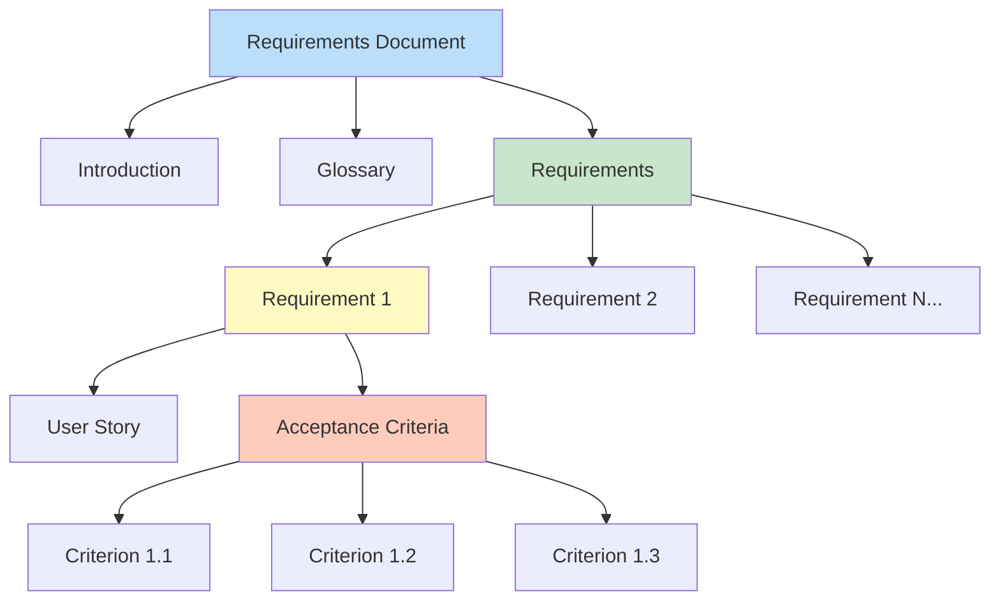

### Why This Matters

- **Clear expectations**: Everyone knows what success looks like
- **Testable**: Each criterion can be verified
- **Complete**: Nothing is left ambiguous

---

## 🎨 Phase 2: Design Document

### What Happened

We created a **design document** that defines HOW the system will work.

**Location**: `.kiro/specs/openai-sentiment-analysis/design.md`

### Key Components

1. **Architecture Diagrams**: Visual representation of system components
   - High-level architecture
   - Component relationships
   - Data flow diagrams

2. **Component Interfaces**: Detailed class and method definitions
   ```python
   class Config:
       api_key: str
       model_name: str = "gpt-3.5-turbo"
       temperature: float = 0.0
       # ... more fields
   ```

3. **Data Models**: Structure of data objects
   ```python
   @dataclass
   class PredictionResult:
       review_id: int
       comment: str
       predicted_sentiment: int  # -1, 0, or 1
       input_tokens: int
       output_tokens: int
   ```

4. **Correctness Properties**: Universal rules the system must follow
   ```
   Property 1: Comment extraction consistency
   For any valid CSV file with a 'comments' column, extracting comments 
   should return a list with length equal to the number of non-null comment rows.
   ```

5. **Error Handling Strategy**: How to handle different error types
   - Rate limit errors → Exponential backoff
   - Network errors → Retry with timeout
   - Invalid responses → Default to neutral

6. **Testing Strategy**: Both unit tests and property-based tests

### Design Document Structure

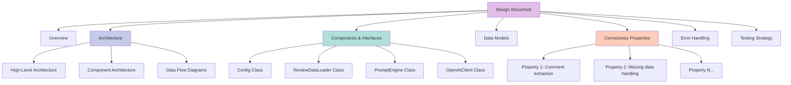

### Why This Matters

- **Blueprint**: Developers know exactly what to build
- **Consistency**: All components work together
- **Quality**: Error handling and testing planned upfront

---

## ✅ Phase 3: Implementation Tasks

### What Happened

We created a **task list** that breaks the design into actionable coding steps.

**Location**: `.kiro/specs/openai-sentiment-analysis/tasks.md`

### Task Structure

Each task includes:
- Clear objective
- Specific requirements it addresses
- Sub-tasks for complex work
- Optional tasks marked with `*`

### Example Task

```markdown
- [ ] 2. Implement Configuration Module
  - Create `Config` dataclass with all configuration parameters
  - Add validation for configuration parameters
  - Implement secure API key input using `getpass` or environment variables
  - Add configuration display function (masking sensitive data)
  - _Requirements: 2.2, 10.1_

- [ ]* 2.1 Write property test for configuration validation
  - **Property 23: Parameter configuration effect**
  - **Validates: Requirements 10.1**
```

### Task Execution with Kiro

Once tasks are defined, you can:

1. **Open the tasks file** in Kiro
2. **Click "Start task"** next to any task
3. **Kiro implements the task** automatically
4. **Review the changes** and provide feedback
5. **Move to the next task**

### Task Execution Flow

```mermaid
graph TD
    A[Task List Created] --> B[Select Next Task]
    B --> C[Click 'Start Task']
    C --> D[Kiro Implements Task]
    D --> E{Has Sub-tasks?}
    
    E -->|Yes| F[Complete Sub-task 1]
    F --> G[Complete Sub-task 2]
    G --> H[Complete Sub-task N]
    H --> I[Mark Parent Task Complete]
    
    E -->|No| I
    
    I --> J{More Tasks?}
    J -->|Yes| B
    J -->|No| K[All Tasks Complete! 🎉]
    
    style A fill:#e1f5ff
    style C fill:#fff3e0
    style D fill:#f3e5f5
    style I fill:#c8e6c9
    style K fill:#a5d6a7
```

### Why This Matters

- **Incremental progress**: Build piece by piece
- **Trackable**: See what's done and what's left
- **Flexible**: Can adjust priorities or skip optional tasks

---

## 🛠️ How We Used Kiro

### Step-by-Step Process

```mermaid
sequenceDiagram
    participant User
    participant Kiro
    participant Specs as Spec Files
    participant Code as Notebook
    
    User->>Kiro: "I want to build sentiment analysis"
    Kiro->>Specs: Create requirements.md
    Kiro->>User: Review requirements?
    User->>Kiro: Approved ✓
    
    Kiro->>Specs: Create design.md
    Kiro->>User: Review design?
    User->>Kiro: Approved ✓
    
    Kiro->>Specs: Create tasks.md
    Kiro->>User: Review tasks?
    User->>Kiro: Approved ✓
    
    User->>Kiro: "Complete all tasks"
    
    loop For each task
        Kiro->>Code: Implement task
        Kiro->>Specs: Mark task complete
    end
    
    Kiro->>User: All tasks complete! 🎉
```

#### 1. Initial Setup
```bash
# Kiro created the spec directory structure
.kiro/specs/openai-sentiment-analysis/
├── requirements.md
├── design.md
└── tasks.md
```

#### 2. Requirements Phase
- Kiro helped write user stories
- Generated acceptance criteria in EARS format
- Created glossary of technical terms
- **User reviewed and approved** requirements

#### 3. Design Phase
- Kiro created architecture diagrams (Mermaid)
- Defined all class interfaces
- Specified correctness properties
- Planned error handling strategy
- **User reviewed and approved** design

#### 4. Implementation Phase
- Kiro broke design into 21 main tasks
- Added 25 optional property-based test tasks
- **User said: "complete all tasks, no need for my input"**
- Kiro implemented all 21 main tasks automatically:
  - Task 1: Setup and dependencies ✅
  - Task 2: Configuration module ✅
  - Task 3: Data loader ✅
  - Task 4: Prompt engine ✅
  - Task 5: OpenAI client wrapper ✅
  - Task 6: Rate limiting and retry logic ✅
  - Task 7: Batch prediction ✅
  - Task 8: Cost tracker ✅
  - Task 9: Prediction pipeline ✅
  - Task 10: Checkpoint ✅
  - Task 11: Results analyzer ✅
  - Task 12: Export functionality ✅
  - Tasks 13-21: Documentation, examples, summary ✅

#### 5. Result
A complete, production-ready Jupyter notebook with:
- 500+ lines of well-structured code
- Comprehensive error handling
- Full documentation
- Ready to run examples

---

## 💡 Key Lessons for Junior Developers

### 1. Spec-Driven Development Works

**Traditional approach:**
```mermaid
graph LR
    A[💡 Idea] --> B[💻 Start Coding]
    B --> C[😱 Forgot Something]
    C --> D[🔧 Refactor]
    D --> E[🐛 More Issues]
    E --> C
    
    style C fill:#ffcdd2
    style E fill:#ffcdd2
```

**Spec-driven approach:**


### 2. Break Big Problems into Small Tasks

Instead of "Build a sentiment analysis notebook" (overwhelming!), we had:
- Task 2: Implement Configuration Module (manageable!)
- Task 3: Implement Data Loader Module (clear!)
- Task 4: Implement Prompt Engine Module (specific!)

### 3. Requirements Drive Everything

Every line of code traces back to a requirement:
```python
# This code exists because of Requirement 2.2:
# "WHEN the API key is required, THE system SHALL prompt 
#  the user securely without exposing the key"

def get_api_key() -> str:
    api_key = os.getenv("OPENAI_API_KEY")
    if not api_key:
        api_key = getpass.getpass("API Key: ")
    return api_key
```

### 4. Design Before Code

The design document answered questions like:
- What classes do we need? → Config, ReviewDataLoader, PromptEngine, etc.
- How do they interact? → Architecture diagrams
- What can go wrong? → Error handling strategy
- How do we test? → Testing strategy

### 5. Kiro as a Pair Programmer

```mermaid
graph TD
    subgraph "Your Responsibilities"
        A[🎯 Define Requirements]
        B[🎨 Design Architecture]
        C[👀 Review Code]
        D[🧪 Test Functionality]
        E[📝 Provide Feedback]
    end
    
    subgraph "Kiro's Responsibilities"
        F[💻 Write Code]
        G[📚 Add Documentation]
        H[🛡️ Error Handling]
        I[✨ Best Practices]
        J[🔄 Refactor as Needed]
    end
    
    A --> F
    B --> F
    F --> C
    C --> E
    E --> J
    J --> D
    
    style A fill:#e1f5ff
    style B fill:#e1f5ff
    style C fill:#e1f5ff
    style F fill:#f3e5f5
    style G fill:#f3e5f5
    style H fill:#f3e5f5
```

Think of Kiro as an experienced developer who:
- ✅ Writes boilerplate code quickly
- ✅ Follows best practices consistently
- ✅ Implements error handling thoroughly
- ✅ Documents code comprehensively
- ✅ Never gets tired or makes typos

But YOU still:
- 🎯 Define what to build (requirements)
- 🎨 Decide how to build it (design)
- 👀 Review the code
- 🧪 Test the functionality
- 📝 Provide feedback

---

## 🎓 Learning Exercise: Try It Yourself!

### Beginner Exercise: Add a New Feature

Let's add a feature to save configuration to a file.

#### Step 1: Add to Requirements
```markdown
### Requirement 11: Configuration Persistence

**User Story:** As a user, I want to save my configuration settings, 
so that I don't have to re-enter them each time.

#### Acceptance Criteria
1. WHEN a user saves configuration, THE system SHALL write settings to a JSON file
2. WHEN loading configuration, THE system SHALL read from the saved file if it exists
3. WHEN saving configuration, THE system SHALL mask the API key in the file
```

#### Step 2: Update Design
```python
class Config:
    # ... existing fields ...
    
    def save_to_file(self, filepath: str) -> None:
        """Save configuration to JSON file with masked API key."""
        pass
    
    @classmethod
    def load_from_file(cls, filepath: str) -> 'Config':
        """Load configuration from JSON file."""
        pass
```

#### Step 3: Add Task
```markdown
- [ ] 22. Implement configuration persistence
  - Add `save_to_file()` method to Config class
  - Add `load_from_file()` class method to Config class
  - Ensure API key is masked when saving
  - Add error handling for file operations
  - _Requirements: 11.1, 11.2, 11.3_
```

#### Step 4: Ask Kiro to Implement
Open the tasks file and click "Start task" next to task 22!

### Intermediate Exercise: Add Visualization

Add a word cloud visualization of positive vs negative reviews.

**Hint:** Follow the same process:
1. Write requirement with user story and acceptance criteria
2. Update design with new class/methods
3. Add task to task list
4. Let Kiro implement it

### Advanced Exercise: Add Database Support

Replace CSV export with SQLite database storage.

**Challenge:** This requires:
- Multiple requirements (CRUD operations)
- New data models (database schema)
- Multiple tasks (create tables, insert, query, update)
- Error handling (connection errors, constraint violations)

---

## 📖 Kiro Best Practices

### 1. Write Clear Requirements

❌ **Bad:** "The system should handle errors"

✅ **Good:** "WHEN an API rate limit error occurs, THE system SHALL retry with exponential backoff up to 3 times"

### 2. Review Each Phase

Don't rush through requirements and design. Kiro will ask:
- "Do the requirements look good?"
- "Does the design look good?"
- "Does the task list look good?"

Take time to review and provide feedback!

### 3. Use Checkpoints

Notice tasks 10 and 20 are checkpoints:
```markdown
- [ ] 10. Checkpoint - Ensure all tests pass
  - Run all property-based tests
  - Verify data loading works
  - Test API integration
  - Ask the user if questions arise
```

These are natural stopping points to test and verify.

### 4. Mark Optional Tasks

Use `*` to mark optional tasks:
```markdown
- [ ]* 2.1 Write property test for configuration validation
```

This lets you build an MVP quickly, then add tests later.

### 5. Reference Requirements

Always link tasks back to requirements:
```markdown
- [ ] 3. Implement Data Loader Module
  - _Requirements: 1.1, 1.2, 1.3, 1.4, 1.5_
```

This ensures nothing is forgotten.

---

## 🔍 Understanding the Code Structure

### Data Flow Through the System

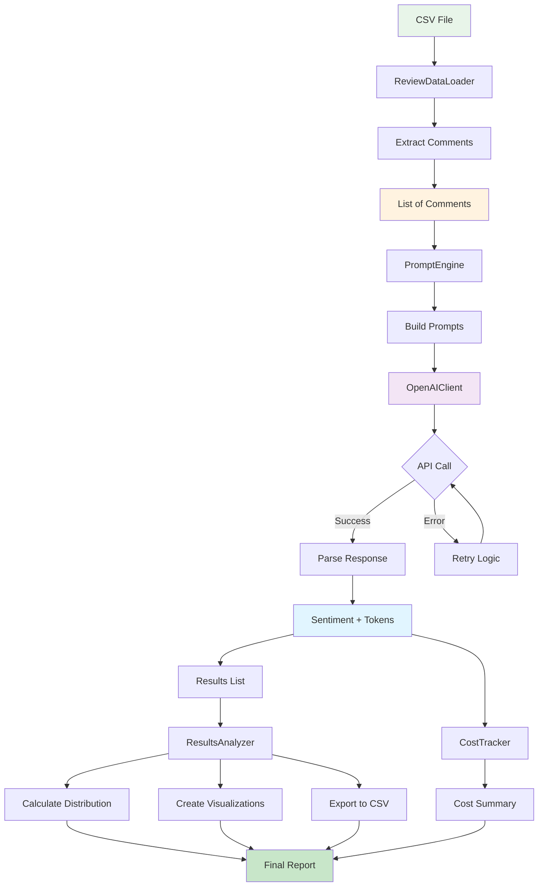

### The Notebook Organization

```mermaid
graph TD
    A[Jupyter Notebook] --> B[1. Setup & Dependencies]
    A --> C[2. Configuration]
    A --> D[3. Data Loading]
    A --> E[4. Prompt Engineering]
    A --> F[5. Sentiment Prediction]
    A --> G[6. Results Analysis]
    A --> H[7. Cost Tracking]
    A --> I[8. Export Results]
    A --> J[9. Summary]
    
    B --> B1[Imports]
    B --> B2[Logging]
    B --> B3[Environment]
    
    C --> C1[Config Class]
    C --> C2[API Key Input]
    C --> C3[Display Settings]
    
    D --> D1[ReviewDataLoader]
    D --> D2[Load CSV]
    D --> D3[Extract Comments]
    
    E --> E1[PromptEngine]
    E --> E2[System Message]
    E --> E3[Few-shot Examples]
    
    F --> F1[OpenAIClient]
    F --> F2[Single Prediction]
    F --> F3[Batch Processing]
    
    G --> G1[ResultsAnalyzer]
    G --> G2[Distribution]
    G --> G3[Visualization]
    
    H --> H1[CostTracker]
    H --> H2[Token Tracking]
    H --> H3[Cost Estimation]
    
    I --> I1[Generate Filename]
    I --> I2[Export CSV]
    I --> I3[Verify Export]
    
    J --> J1[Dataset Selection]
    J --> J2[Final Summary]
    J --> J3[Recommendations]
    
    style A fill:#e1bee7
    style B fill:#bbdefb
    style C fill:#c8e6c9
    style D fill:#fff9c4
    style E fill:#ffccbc
    style F fill:#b2dfdb
    style G fill:#f8bbd0
    style H fill:#c5cae9
    style I fill:#dcedc8
    style J fill:#ffe0b2
```

### Design Patterns Used

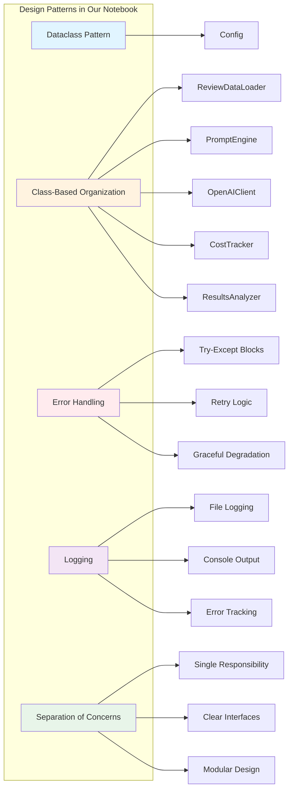

1. **Dataclass Pattern**: Config uses `@dataclass` for clean data structures
2. **Class-Based Organization**: Each module is a class (ReviewDataLoader, PromptEngine, etc.)
3. **Error Handling**: Try-except blocks with specific error types
4. **Logging**: Consistent logging throughout for debugging
5. **Separation of Concerns**: Each class has a single responsibility

---

## 🚦 Common Pitfalls to Avoid

### 1. Skipping Requirements

❌ "Let's just start coding and figure it out as we go"

✅ "Let's write requirements first so we know what success looks like"

### 2. Vague Acceptance Criteria

❌ "The system should work well"

✅ "WHEN processing 100 reviews, THE system SHALL complete in under 5 minutes"

### 3. Not Reviewing Kiro's Output

❌ Blindly accepting all code without reading it

✅ Review each implementation, test it, provide feedback

### 4. Ignoring the Design Phase

❌ Going straight from requirements to tasks

✅ Create a design document to think through architecture

### 5. Making Tasks Too Big

❌ "Implement the entire sentiment analysis system"

✅ "Implement the Configuration Module" (one component at a time)

---

## 📚 Additional Resources

### Learn More About Kiro

- **Specs**: Structured way to build features with requirements, design, and tasks
- **Steering Files**: Custom instructions for your project (in `.kiro/steering/`)
- **Hooks**: Automated actions triggered by events (like saving a file)
- **Powers**: Reusable packages with tools and documentation

### Learn More About This Project

- **OpenAI API Docs**: https://platform.openai.com/docs
- **Prompt Engineering**: https://www.promptingguide.ai/
- **Property-Based Testing**: https://hypothesis.readthedocs.io/
- **Airbnb Dataset**: http://insideairbnb.com/get-the-data.html

### Practice Projects

Try building these with Kiro:

1. **Beginner**: Weather dashboard using a weather API
2. **Intermediate**: Task management CLI tool
3. **Advanced**: Web scraper with data analysis

---

## 🎉 Conclusion

You've learned how to use Kiro for spec-driven development:

1. ✅ Write clear requirements with user stories and acceptance criteria
2. ✅ Create detailed design documents with architecture and interfaces
3. ✅ Break work into manageable tasks
4. ✅ Let Kiro implement tasks while you review and guide
5. ✅ Build production-ready code faster and with fewer bugs

### The Big Picture

Kiro doesn't replace developers—it amplifies them. You still need to:
- Understand the problem
- Make design decisions
- Review code quality
- Test functionality
- Provide domain expertise

But Kiro handles:
- Writing boilerplate code
- Implementing standard patterns
- Adding error handling
- Writing documentation
- Following best practices

### Your Learning Path

```mermaid
graph TD
    A[Start Here] --> B[📖 Read This README]
    B --> C[📋 Review Spec Files]
    
    C --> D[requirements.md]
    C --> E[design.md]
    C --> F[tasks.md]
    
    D --> G[🔍 Explore Notebook]
    E --> G
    F --> G
    
    G --> H{Understand How It Works?}
    H -->|Not Yet| C
    H -->|Yes!| I[🎓 Try Beginner Exercise]
    
    I --> J{Completed?}
    J -->|Need Help| C
    J -->|Yes!| K[🎯 Try Intermediate Exercise]
    
    K --> L{Completed?}
    L -->|Need Help| C
    L -->|Yes!| M[🚀 Try Advanced Exercise]
    
    M --> N{Completed?}
    N -->|Need Help| C
    N -->|Yes!| O[💪 Build Your Own Project]
    
    O --> P[🎉 You're a Kiro Expert!]
    
    style A fill:#e1f5ff
    style B fill:#fff3e0
    style G fill:#f3e5f5
    style I fill:#c8e6c9
    style K fill:#b2dfdb
    style M fill:#a5d6a7
    style O fill:#81c784
    style P fill:#66bb6a
```

### Next Steps

1. **Explore the notebook**: Run it, modify it, break it, fix it
2. **Read the spec files**: See how requirements → design → tasks
3. **Try the exercises**: Add new features using the Kiro workflow
4. **Build your own project**: Start with requirements, let Kiro help implement

Happy coding! 🚀

---

## 📞 Questions?

If you're learning Kiro and have questions:

1. Check the spec files in `.kiro/specs/openai-sentiment-analysis/`
2. Review the task list to see how work was broken down
3. Look at the notebook to see the final implementation
4. Try the exercises above to practice

Remember: The best way to learn is by doing. Start small, use the spec-driven workflow, and let Kiro help you build amazing things!
