# Spec-Driven Development with Kiro

## 📖 A Complete Guide for Developers

This document explains the philosophy, methodology, and best practices of spec-driven development using Kiro. Whether you're a junior developer or an experienced engineer, this guide will help you understand how to build better software faster.

---

## 🎯 Table of Contents

1. [What is Spec-Driven Development?](#what-is-spec-driven-development)
2. [Why Spec-Driven Development?](#why-spec-driven-development)
3. [The Three Pillars](#the-three-pillars)
4. [The Spec-Driven Workflow](#the-spec-driven-workflow)
5. [Best Practices](#best-practices)
6. [Common Patterns](#common-patterns)
7. [Glossary](#glossary)
8. [FAQ](#faq)

---

## 🤔 What is Spec-Driven Development?

**Spec-Driven Development (SDD)** is a software development methodology where you define the complete specification of your software before writing any code. The specification consists of three key documents:

```mermaid
graph LR
    A[💡 Idea] --> B[📋 Requirements]
    B --> C[🎨 Design]
    C --> D[✅ Tasks]
    D --> E[💻 Code]
    
    style B fill:#fff3e0
    style C fill:#f3e5f5
    style D fill:#e8f5e9
    style E fill:#e1f5ff
```



### The Three Documents

1. **Requirements** (`requirements.md`) - WHAT the system should do
2. **Design** (`design.md`) - HOW the system will work
3. **Tasks** (`tasks.md`) - STEPS to build the system

### Key Principle

> "Measure twice, cut once" - By thinking through requirements and design first, you avoid costly rewrites and ensure you build the right thing.

---

## 💡 Why Spec-Driven Development?

### Traditional Development Problems


### Spec-Driven Development Solution


### Benefits

| Traditional | Spec-Driven |
|------------|-------------|
| ❌ Unclear requirements | ✅ Crystal clear requirements |
| ❌ Frequent rewrites | ✅ Build it right the first time |
| ❌ Scope creep | ✅ Controlled scope |
| ❌ Poor architecture | ✅ Well-designed architecture |
| ❌ Hard to test | ✅ Testable from the start |
| ❌ Difficult to maintain | ✅ Easy to maintain |
| ❌ Team confusion | ✅ Team alignment |

---

## 🏛️ The Three Pillars

### Pillar 1: Requirements Document

**Purpose**: Define WHAT the system should do from the user's perspective.

**Structure**:
```markdown
# Requirements Document

## Introduction
Brief overview of the feature/system

## Glossary
- **Term 1**: Definition
- **Term 2**: Definition

## Requirements

### Requirement 1
**User Story**: As a [role], I want [feature], so that [benefit]

#### Acceptance Criteria
1. WHEN [trigger], THE system SHALL [response]
2. WHERE [condition], THE system SHALL [response]
3. IF [error], THEN THE system SHALL [response]
```

**Key Concepts**:

- **User Stories**: Written from user's perspective
- **Acceptance Criteria**: Testable, specific requirements using EARS format
- **Glossary**: Defines all technical terms
- **Traceability**: Each criterion can be traced to code

**Example**:
```markdown
### Requirement 3: Error Handling

**User Story**: As a developer, I want comprehensive error handling, 
so that the system recovers gracefully from failures.

#### Acceptance Criteria
1. WHEN an API rate limit is exceeded, THE system SHALL retry with exponential backoff
2. WHEN a network error occurs, THE system SHALL log the error and continue processing
3. IF invalid data is received, THEN THE system SHALL default to safe values
```

### Pillar 2: Design Document

**Purpose**: Define HOW the system will be built.

**Structure**:
```markdown
# Design Document

## Overview
High-level description

## Architecture
- System architecture diagrams
- Component relationships
- Data flow

## Components and Interfaces
- Class definitions
- Method signatures
- API contracts

## Data Models
- Data structures
- Database schemas
- Message formats

## Correctness Properties
- Universal rules the system must follow
- Property-based testing specifications

## Error Handling
- Error types and strategies
- Recovery mechanisms

## Testing Strategy
- Unit tests
- Integration tests
- Property-based tests
```

**Key Concepts**:

- **Architecture Diagrams**: Visual representation using Mermaid
- **Interfaces**: Clear contracts between components
- **Correctness Properties**: Universal rules for property-based testing
- **Design Decisions**: Rationale for technical choices

**Example**:
```markdown
## Components and Interfaces

### Config Class
```python
@dataclass
class Config:
    api_key: str
    model_name: str = "gpt-3.5-turbo"
    temperature: float = 0.0
    
    def validate(self) -> None:
        """Validate configuration parameters."""
        pass
    
    def display(self) -> None:
        """Display config with masked sensitive data."""
        pass
```

### Correctness Properties

**Property 1: Configuration Validation**
*For any* Config instance, if validation passes, then all parameters 
must be within valid ranges.
**Validates: Requirements 2.1**
```

### Pillar 3: Tasks Document

**Purpose**: Break the design into actionable implementation steps.

**Structure**:
```markdown
# Implementation Plan

## Tasks

- [ ] 1. Implement Core Module
  - Create base classes
  - Add validation logic
  - Implement error handling
  - _Requirements: 1.1, 1.2, 1.3_

- [ ]* 1.1 Write property tests
  - **Property 1: Validation consistency**
  - **Validates: Requirements 1.1**

- [ ] 2. Implement Feature X
  - Sub-task 2.1
  - Sub-task 2.2
  - _Requirements: 2.1, 2.2_
```

**Key Concepts**:

- **Hierarchical Tasks**: Parent tasks with sub-tasks
- **Optional Tasks**: Marked with `*` (like tests)
- **Requirement Tracing**: Each task references requirements
- **Incremental**: Build piece by piece

---

## 🔄 The Spec-Driven Workflow

### Phase 1: Requirements Gathering


**Activities**:
1. Brainstorm features and functionality
2. Write user stories for each feature
3. Define acceptance criteria (testable!)
4. Create glossary of terms
5. Review and refine until clear

**Questions to Ask**:
- Who are the users?
- What problems are we solving?
- What does success look like?
- What are the edge cases?
- What can go wrong?

### Phase 2: Design Creation


**Activities**:
1. Create architecture diagrams
2. Define all classes and interfaces
3. Specify data models
4. Write correctness properties
5. Plan error handling
6. Design testing strategy
7. Review and refine

**Questions to Ask**:
- How do components interact?
- What are the data structures?
- What can we test automatically?
- How do we handle errors?
- Is this maintainable?

### Phase 3: Task Planning

```mermaid
sequenceDiagram
    participant Dev as Developer
    participant Kiro as Kiro Agent
    participant Spec as tasks.md
    
    Kiro->>Spec: Break design into tasks
    Kiro->>Spec: Add sub-tasks
    Kiro->>Spec: Mark optional tasks
    Kiro->>Spec: Reference requirements
    Kiro->>Dev: Review tasks?
    
    loop Until Approved
        Dev->>Kiro: Feedback/changes
        Kiro->>Spec: Update tasks
        Kiro->>Dev: Review again?
    end
    
    Dev->>Kiro: Approved ✓
```



**Activities**:
1. Break design into discrete tasks
2. Order tasks logically
3. Add sub-tasks for complex work
4. Mark optional tasks (tests, docs)
5. Reference requirements
6. Review and refine

**Questions to Ask**:
- Can each task be done independently?
- Are tasks small enough?
- Is the order logical?
- What's required vs optional?

### Phase 4: Implementation


**Activities**:
1. Select next task from list
2. Kiro implements the task
3. Review the implementation
4. Test the functionality
5. Mark task complete
6. Move to next task

**Developer's Role**:
- 👀 Review code quality
- 🧪 Test functionality
- 📝 Provide feedback
- ✅ Approve completion

---

## ✨ Best Practices

### 1. Start with Why

Always begin with the problem you're solving:

```markdown
❌ Bad: "Build a configuration system"
✅ Good: "As a developer, I want to configure API settings, 
         so that I can customize behavior without changing code"
```

### 2. Make Requirements Testable

Every acceptance criterion should be verifiable:

```markdown
❌ Bad: "The system should be fast"
✅ Good: "WHEN processing 1000 records, THE system SHALL complete in under 30 seconds"
```

### 3. Use EARS Format

EARS (Easy Approach to Requirements Syntax) provides clear patterns:

- **WHEN** [trigger] → Event-driven
- **WHERE** [condition] → Optional feature
- **WHILE** [state] → State-driven
- **IF** [error] → Unwanted event
- **THE system SHALL** [response] → Required action

### 4. Design Before Code

Spend time on architecture:


### 5. Break Tasks Small

Each task should be completable in one session:

```markdown
❌ Too Big: "Implement entire API"
✅ Just Right: "Implement GET /users endpoint"
✅ Just Right: "Add error handling to API"
✅ Just Right: "Write tests for API endpoints"
```

### 6. Use Correctness Properties

Define universal rules for property-based testing:

```markdown
**Property 1: Round-trip consistency**
*For any* valid data object, serializing then deserializing 
should produce an equivalent object.
```

### 7. Review Each Phase

Don't rush through reviews:


### 8. Trace Everything

Maintain traceability:

```
Requirement 2.3 → Design Component X → Task 5 → Code in module.py:123
```

### 9. Document Decisions

Explain WHY, not just WHAT:

```markdown
## Design Decision: Use SQLite

**Rationale**: 
- No separate database server needed
- Perfect for single-user applications
- Built into Python standard library
- Sufficient performance for our use case

**Alternatives Considered**:
- PostgreSQL: Too heavy for our needs
- JSON files: No query capabilities
```

### 10. Iterate and Improve

Specs are living documents:


---

## 🎨 Common Patterns

### Pattern 1: CRUD Operations

**Requirements Template**:
```markdown
### Requirement: [Entity] Management

**User Story**: As a [role], I want to manage [entities], 
so that I can [benefit].

#### Acceptance Criteria
1. WHEN creating a [entity], THE system SHALL validate all required fields
2. WHEN reading a [entity], THE system SHALL return all stored data
3. WHEN updating a [entity], THE system SHALL preserve data integrity
4. WHEN deleting a [entity], THE system SHALL remove all associated data
5. IF a [entity] does not exist, THEN THE system SHALL return a clear error
```

### Pattern 2: API Integration

**Requirements Template**:
```markdown
### Requirement: [Service] API Integration

**User Story**: As a developer, I want to integrate with [service], 
so that I can [benefit].

#### Acceptance Criteria
1. WHEN initializing the client, THE system SHALL authenticate securely
2. WHEN making API calls, THE system SHALL implement rate limiting
3. WHEN API errors occur, THE system SHALL retry with exponential backoff
4. WHEN responses are received, THE system SHALL validate the data
5. IF authentication fails, THEN THE system SHALL provide clear error messages
```

### Pattern 3: Data Processing Pipeline

**Requirements Template**:
```markdown
### Requirement: Data Processing

**User Story**: As a data analyst, I want to process [data], 
so that I can [benefit].

#### Acceptance Criteria
1. WHEN loading data, THE system SHALL validate the format
2. WHEN processing data, THE system SHALL handle missing values
3. WHEN errors occur, THE system SHALL continue processing remaining items
4. WHEN processing completes, THE system SHALL provide a summary
5. IF data is invalid, THEN THE system SHALL log the error and skip the item
```

### Pattern 4: Configuration Management

**Requirements Template**:
```markdown
### Requirement: Configuration

**User Story**: As a developer, I want to configure [system], 
so that I can customize behavior.

#### Acceptance Criteria
1. WHEN loading configuration, THE system SHALL validate all parameters
2. WHEN sensitive data is displayed, THE system SHALL mask it
3. WHEN configuration is invalid, THE system SHALL provide clear error messages
4. WHERE configuration is not provided, THE system SHALL use sensible defaults
5. IF configuration changes, THEN THE system SHALL reload without restart
```

---

## 📚 Glossary

### Core Concepts

#### Agent
An AI-powered assistant that can understand natural language instructions and execute tasks autonomously. In Kiro, agents can read code, write code, run tests, and interact with various tools.

**Example**: "The Kiro agent implemented all 21 tasks automatically."

#### Spec (Specification)
A formal document that defines what software should do (requirements), how it should work (design), and the steps to build it (tasks). Specs are stored in `.kiro/specs/[feature-name]/`.

**Example**: "We created a spec for the sentiment analysis feature."

#### Spec-Driven Development (SDD)
A methodology where you write complete specifications (requirements, design, tasks) before writing any code. This ensures you build the right thing correctly.

**Example**: "Using spec-driven development, we avoided three major refactors."

#### Requirements Document
A document that defines WHAT the system should do from the user's perspective. Contains user stories and acceptance criteria.

**Location**: `.kiro/specs/[feature-name]/requirements.md`

#### Design Document
A document that defines HOW the system will work. Contains architecture, components, data models, and correctness properties.

**Location**: `.kiro/specs/[feature-name]/design.md`

#### Tasks Document
A document that breaks the design into actionable implementation steps. Contains a checklist of tasks with sub-tasks.

**Location**: `.kiro/specs/[feature-name]/tasks.md`

### Requirements Concepts

#### User Story
A requirement written from the user's perspective: "As a [role], I want [feature], so that [benefit]."

**Example**: "As a data analyst, I want to visualize results, so that I can understand patterns."

#### Acceptance Criteria
Specific, testable conditions that must be met for a requirement to be satisfied. Written using EARS format.

**Example**: "WHEN a user submits invalid data, THE system SHALL display a clear error message."

#### EARS (Easy Approach to Requirements Syntax)
A structured format for writing requirements using keywords like WHEN, WHERE, WHILE, IF, THEN, and SHALL.

**Example**: "WHEN the API rate limit is exceeded, THE system SHALL retry with exponential backoff."

#### Glossary
A section in the requirements document that defines all technical terms used in the specification.

**Example**: "**API Key**: Authentication credential for accessing external services."

### Design Concepts

#### Architecture Diagram
A visual representation of system components and their relationships, typically created using Mermaid.

**Example**: 


#### Component
A modular part of the system with a specific responsibility. Usually implemented as a class or module.

**Example**: "The `ReviewDataLoader` component handles CSV file loading."

#### Interface
A contract that defines how components interact. Specifies method signatures and expected behavior.

**Example**: 
```python
def load_reviews(file_path: str) -> pd.DataFrame:
    """Load reviews from CSV file."""
```

#### Data Model
The structure of data used in the system. Defines fields, types, and relationships.

**Example**:
```python
@dataclass
class Review:
    id: int
    comment: str
    sentiment: int
```

#### Correctness Property
A universal rule that should hold true for all valid inputs. Used for property-based testing.

**Example**: "For any valid CSV file, loading then saving should preserve all data."

#### Property-Based Testing (PBT)
A testing approach where you define properties that should always be true, then automatically test with many random inputs.

**Example**: "Test that sorting a list always produces a sorted result, regardless of input."

### Task Concepts

#### Task
A discrete unit of work that can be implemented independently. Tasks are checked off as they're completed.

**Example**: "- [x] 2. Implement Configuration Module"

#### Sub-task
A smaller piece of work that's part of a larger task. Helps break complex tasks into manageable pieces.

**Example**: "- [x] 2.1 Add validation for configuration parameters"

#### Optional Task
A task marked with `*` that can be skipped for MVP development. Usually tests or documentation.

**Example**: "- [ ]* 2.1 Write property test for configuration validation"

#### Checkpoint
A task that verifies all previous work is correct before proceeding. Usually involves running tests.

**Example**: "- [ ] 10. Checkpoint - Ensure all tests pass"

### Kiro Features

#### MCP (Model Context Protocol)
A protocol that allows Kiro to connect to external tools and services. MCP servers provide additional capabilities like file search, web browsing, or database access.

**Configuration**: `.kiro/settings/mcp.json`

**Example**: "We added an MCP server for accessing the weather API."

#### Hooks
Automated actions triggered by events in the IDE. Hooks can run commands or send messages to the agent when you save a file, start a session, or complete a task.

**Types**:
- **On Save**: Trigger when you save a file
- **On Session Start**: Trigger when you start a new chat
- **On Message**: Trigger when you send a message
- **Manual**: Trigger when you click a button

**Example**: "We created a hook that runs tests automatically when we save a Python file."

#### Steering Files
Custom instructions that guide Kiro's behavior for your project. Stored in `.kiro/steering/` and can be always included, conditionally included, or manually included.

**Types**:
- **Always Included**: Applied to all interactions
- **Conditional**: Applied when specific files are read
- **Manual**: Applied when you reference them with `#`

**Example**: "We added a steering file with our team's coding standards."

#### Powers
Reusable packages that bundle MCP servers, steering files, and documentation. Powers extend Kiro's capabilities for specific domains.

**Example**: "We installed the AWS power to help with cloud infrastructure."

#### Context
Information that Kiro has access to during a conversation. Can include files, folders, terminal output, git diffs, or the entire codebase.

**Ways to Add Context**:
- `#File` - Include a specific file
- `#Folder` - Include a folder
- `#Codebase` - Search the entire codebase
- `#Terminal` - Include terminal output
- `#Problems` - Include IDE diagnostics

**Example**: "I added #File config.py to give Kiro context about our configuration."

### Development Concepts

#### Autopilot Mode
A Kiro mode where the agent can modify files autonomously without asking for permission each time.

**Example**: "In autopilot mode, Kiro implemented all 21 tasks without interruption."

#### Supervised Mode
A Kiro mode where you review and approve each change before it's applied.

**Example**: "In supervised mode, I reviewed each task implementation before proceeding."

#### Incremental Development
Building software piece by piece, with each piece fully working before moving to the next.

**Example**: "We built the config module, tested it, then moved to the data loader."

#### Traceability
The ability to trace code back to requirements and design decisions.

**Example**: "This error handling code traces back to Requirement 9.2."

#### Refactoring
Restructuring code without changing its behavior. Often needed when requirements change or design flaws are discovered.

**Example**: "We refactored the API client to support multiple authentication methods."

### Testing Concepts

#### Unit Test
A test that verifies a single function or method works correctly in isolation.

**Example**: "Test that `validate_email()` rejects invalid email addresses."

#### Integration Test
A test that verifies multiple components work together correctly.

**Example**: "Test that the API client can authenticate and fetch data from the real API."

#### Property-Based Test
A test that verifies a universal property holds for many randomly generated inputs.

**Example**: "Test that sorting any list always produces a sorted result."

#### Test Coverage
The percentage of code that is executed by tests. Higher coverage means more code is tested.

**Example**: "We achieved 85% test coverage for the core modules."

#### Edge Case
An unusual or extreme input that might cause problems. Important to test explicitly.

**Example**: "Empty strings, null values, and very long inputs are edge cases."

### Architecture Concepts

#### Separation of Concerns
Design principle where each component has a single, well-defined responsibility.

**Example**: "The `DataLoader` only loads data; it doesn't process or analyze it."

#### Modularity
Designing systems as independent, interchangeable modules.

**Example**: "We can swap the CSV loader for a database loader without changing other code."

#### Error Handling
Code that detects and responds to errors gracefully.

**Strategies**:
- **Retry**: Try again after a delay
- **Fallback**: Use a default value
- **Fail Fast**: Stop immediately and report the error
- **Graceful Degradation**: Continue with reduced functionality

**Example**: "When the API fails, we retry with exponential backoff."

#### Logging
Recording events and errors for debugging and monitoring.

**Levels**: DEBUG, INFO, WARNING, ERROR, CRITICAL

**Example**: "We log all API calls at INFO level and errors at ERROR level."

---

## ❓ FAQ

### Q: How long does spec-driven development take?

**A**: The spec phase typically takes 10-20% of total project time, but saves 50%+ in implementation time by avoiding rewrites and confusion.

**Example Timeline**:
- Traditional: 2 hours planning + 40 hours coding/refactoring = 42 hours
- Spec-Driven: 8 hours spec + 20 hours coding = 28 hours (33% faster!)

### Q: Can I skip the design phase?

**A**: You can, but you shouldn't. The design phase is where you catch architectural problems before they become expensive to fix.

**Cost of Fixing Bugs**:
- During design: 1x cost
- During implementation: 10x cost
- After deployment: 100x cost

### Q: What if requirements change?

**A**: Update the spec! Specs are living documents. When requirements change:
1. Update `requirements.md`
2. Update `design.md` if needed
3. Update `tasks.md` if needed
4. Implement the changes

### Q: How detailed should requirements be?

**A**: Detailed enough to be testable. If you can't verify it, it's not detailed enough.

**Too Vague**: "The system should be user-friendly"
**Just Right**: "WHEN a user makes an error, THE system SHALL display a clear message explaining how to fix it"

### Q: Should I write all tasks before starting?

**A**: Yes for the main tasks, but you can add sub-tasks as you go. The key is having a clear roadmap.

### Q: Can Kiro write the specs for me?

**A**: Kiro can help generate initial specs, but YOU must review and refine them. You're the domain expert!

### Q: What if I don't know the design yet?

**A**: That's okay! Start with requirements, then explore design options. The spec process helps you think through the design.

### Q: How do I handle optional features?

**A**: Mark them clearly in requirements and tasks:
- Requirements: "WHERE [optional feature is enabled]..."
- Tasks: "- [ ]* Optional task"

### Q: Should I use spec-driven development for small projects?

**A**: Even small projects benefit from clear requirements. You can simplify the process:
- Small project: Brief requirements + task list
- Medium project: Full requirements + design + tasks
- Large project: Detailed specs + multiple reviews

### Q: What if my team doesn't use specs?

**A**: Start small! Use specs for your own work, then share the benefits with your team. Show them how it reduces bugs and speeds up development.

### Q: How do I know when a spec is "done"?

**A**: A spec is done when:
- ✅ All stakeholders understand and agree
- ✅ Requirements are testable
- ✅ Design is complete and clear
- ✅ Tasks are actionable
- ✅ You could hand it to another developer and they could implement it

---

## 🎓 Learning Path

### Beginner: Start Here


**Practice Project**: Build a simple todo list app
1. Write 3-5 requirements
2. Design 2-3 classes
3. Create 5-10 tasks
4. Let Kiro implement

### Intermediate: Level Up


**Practice Project**: Build an API client with error handling
1. Write 10+ requirements with EARS
2. Design complete architecture
3. Define 5+ correctness properties
4. Create 20+ tasks
5. Implement with property-based tests

### Advanced: Master Level


**Practice Project**: Build a microservices system
1. Write requirements for multiple services
2. Design service interactions
3. Specify API contracts
4. Plan deployment strategy
5. Implement with full testing

---

## 🚀 Next Steps

1. **Read the Example**: Check out `README_KIRO_WORKFLOW.md` to see spec-driven development in action
2. **Study the Specs**: Look at `.kiro/specs/openai-sentiment-analysis/` for a real example
3. **Try It Yourself**: Start with a small project and write your first spec
4. **Join the Community**: Share your specs and learn from others
5. **Keep Improving**: Refine your process with each project

---

## 📖 Additional Resources

### Official Documentation
- Kiro Documentation: [Link to docs]
- EARS Format Guide: [Link to EARS]
- Property-Based Testing: https://hypothesis.readthedocs.io/

### Books
- "Writing Effective Use Cases" by Alistair Cockburn
- "Software Requirements" by Karl Wiegers
- "Clean Architecture" by Robert C. Martin

### Articles
- "The Power of Specifications" [Link]
- "Why Requirements Matter" [Link]
- "Design Before Code" [Link]

---

## 💬 Feedback

Have questions or suggestions about spec-driven development? 

- Open an issue
- Start a discussion
- Share your specs
- Contribute improvements

---

**Remember**: Spec-driven development is a skill that improves with practice. Start small, learn from each project, and gradually build more complex systems. The time you invest in specifications pays dividends in faster development, fewer bugs, and better software.

Happy spec writing! 📝✨
