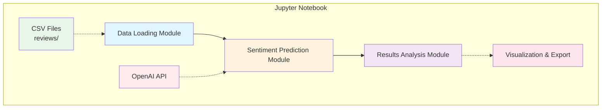
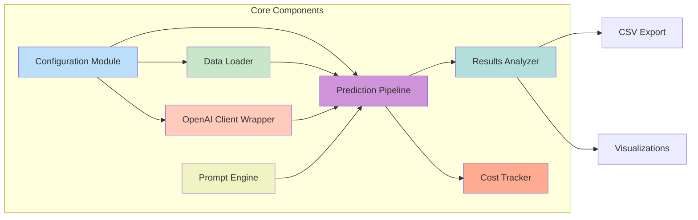
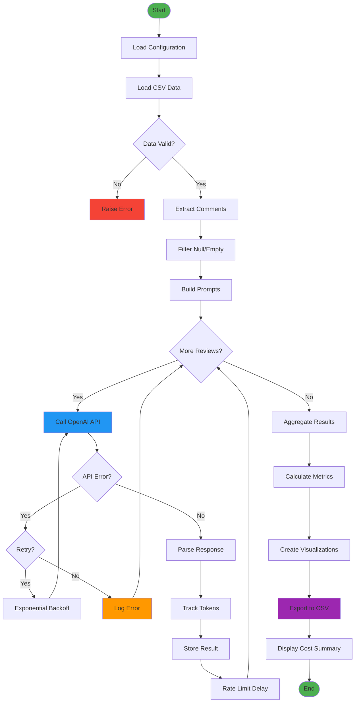
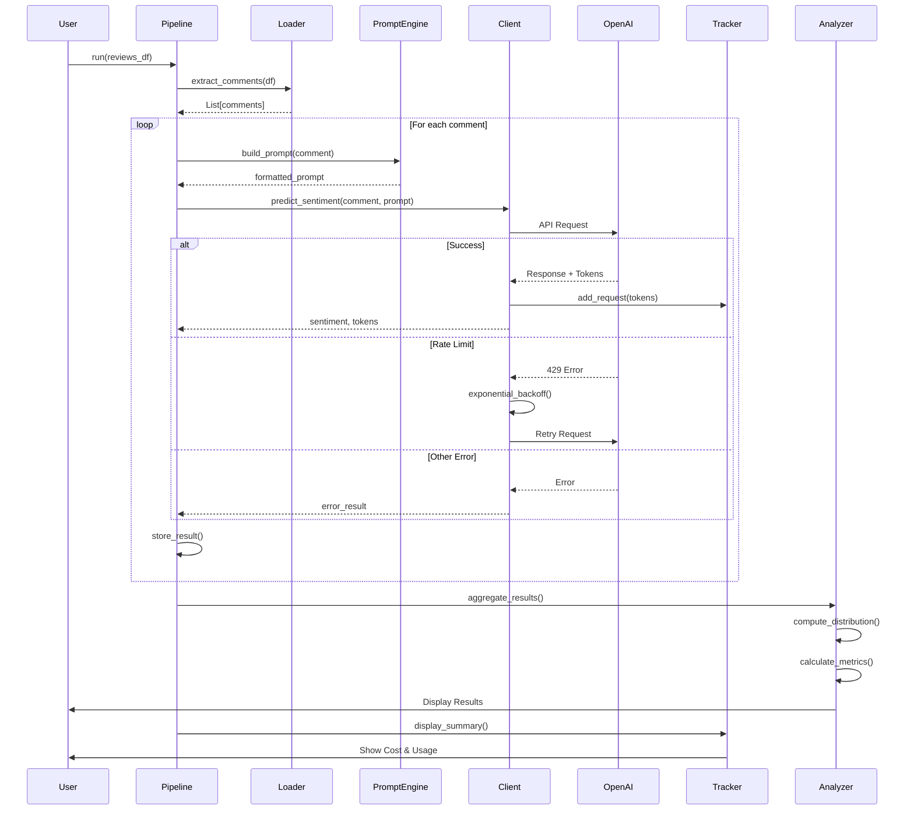
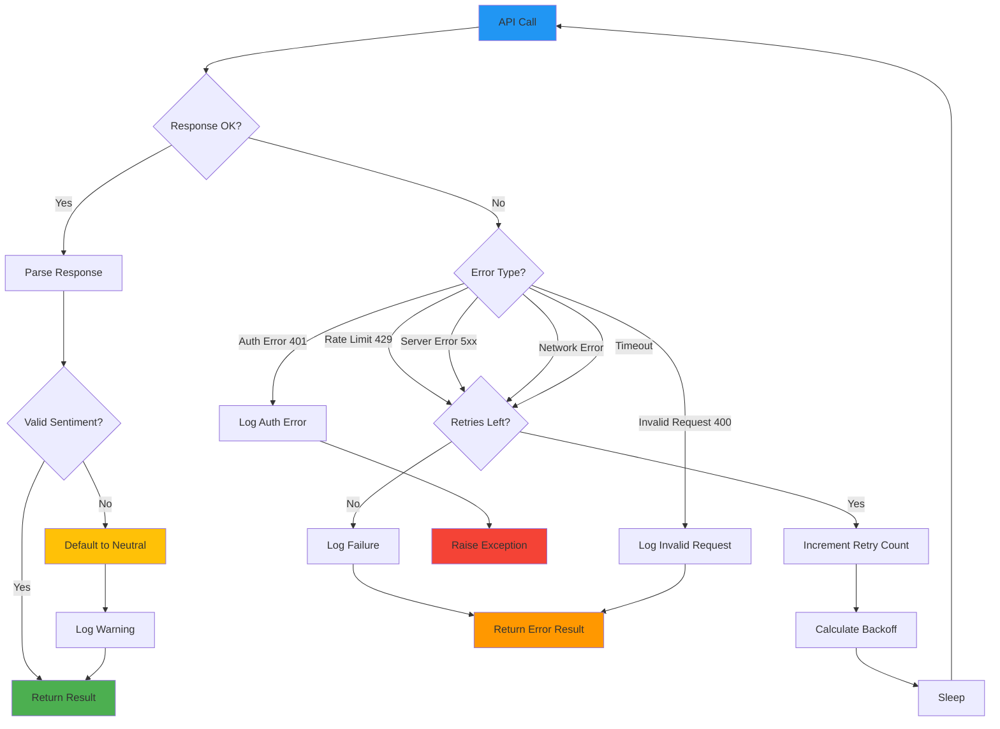

# Design Document: OpenAI Sentiment Analysis for Airbnb Reviews

## Overview

This design document outlines the technical approach for implementing a Jupyter notebook that uses OpenAI's Large Language Models (LLMs) to perform sentiment analysis on Airbnb review comments. The solution will integrate with OpenAI's API, process review data from CSV files, and predict sentiment classifications (positive, neutral, negative) using prompt engineering techniques.

The notebook will follow the established patterns in the project while introducing OpenAI as an alternative to IBM Watson services, providing users with flexibility in choosing their sentiment analysis provider.

## Architecture

### High-Level Architecture



### Component Architecture



**Component Descriptions:**

1. **Configuration Module**: Manages API keys, model parameters, and runtime settings
2. **Data Loader**: Reads and preprocesses CSV files containing Airbnb reviews
3. **OpenAI Client Wrapper**: Handles API authentication, rate limiting, and error handling
4. **Prompt Engine**: Constructs and manages prompts for sentiment classification
5. **Prediction Pipeline**: Orchestrates batch processing of reviews
6. **Results Analyzer**: Computes metrics, generates visualizations, and exports data
7. **Cost Tracker**: Monitors token usage and estimates API costs

### Data Flow Diagram



### Prediction Sequence Diagram



## Components and Interfaces

### 1. Configuration Module

**Purpose**: Centralize all configuration parameters and credentials

**Interface**:
```python
class Config:
    """Configuration for OpenAI sentiment analysis"""
    
    # API Configuration
    api_key: str
    model_name: str = "gpt-3.5-turbo"
    
    # Model Parameters
    temperature: float = 0.0  # Deterministic for consistency
    max_tokens: int = 10      # Short responses for sentiment labels
    
    # Processing Configuration
    batch_size: int = 100
    max_reviews: Optional[int] = None
    rate_limit_delay: float = 0.5  # Seconds between requests
    
    # File Configuration
    data_file: str = "reviews/paris-2015-09-02-reviews.csv"
    output_dir: str = "results/"
    
    # Retry Configuration
    max_retries: int = 3
    backoff_factor: float = 2.0
```

### 2. Data Loader

**Purpose**: Load and preprocess review data from CSV files

**Interface**:
```python
class ReviewDataLoader:
    """Loads and preprocesses Airbnb review data"""
    
    def load_reviews(self, file_path: str, max_rows: Optional[int] = None) -> pd.DataFrame:
        """Load reviews from CSV file"""
        pass
    
    def extract_comments(self, df: pd.DataFrame) -> List[str]:
        """Extract comment column and handle missing values"""
        pass
    
    def validate_data(self, df: pd.DataFrame) -> bool:
        """Validate that required columns exist"""
        pass
    
    def get_sample(self, df: pd.DataFrame, n: int = 5) -> pd.DataFrame:
        """Get sample records for display"""
        pass
```

**Key Methods**:
- `load_reviews()`: Reads CSV with error handling for large files
- `extract_comments()`: Filters out null/empty comments
- `validate_data()`: Ensures 'comments' column exists
- `get_sample()`: Returns representative samples for verification

### 3. OpenAI Client Wrapper

**Purpose**: Manage OpenAI API interactions with robust error handling

**Interface**:
```python
class OpenAIClient:
    """Wrapper for OpenAI API with error handling and rate limiting"""
    
    def __init__(self, api_key: str, model: str, config: Config):
        """Initialize OpenAI client"""
        pass
    
    def predict_sentiment(self, comment: str, prompt_template: str) -> Dict[str, Any]:
        """Predict sentiment for a single comment"""
        pass
    
    def batch_predict(self, comments: List[str], prompt_template: str) -> List[Dict[str, Any]]:
        """Predict sentiment for multiple comments with rate limiting"""
        pass
    
    def _handle_rate_limit(self, retry_count: int) -> None:
        """Implement exponential backoff for rate limits"""
        pass
    
    def _parse_response(self, response: Any) -> Tuple[int, int]:
        """Extract sentiment and token count from API response"""
        pass
```

**Error Handling**:
- Rate limit errors: Exponential backoff with configurable retries
- Network errors: Retry with timeout
- Invalid responses: Validation and fallback to neutral sentiment
- Authentication errors: Clear error messages with remediation steps

### 4. Prompt Engine

**Purpose**: Construct effective prompts for sentiment classification

**Interface**:
```python
class PromptEngine:
    """Manages prompt construction for sentiment analysis"""
    
    def __init__(self, few_shot_examples: Optional[List[Dict]] = None):
        """Initialize with optional few-shot examples"""
        pass
    
    def build_prompt(self, comment: str) -> str:
        """Construct complete prompt for a comment"""
        pass
    
    def get_system_message(self) -> str:
        """Get system message defining the task"""
        pass
    
    def get_few_shot_examples(self) -> str:
        """Format few-shot examples for the prompt"""
        pass
    
    def validate_response(self, response: str) -> bool:
        """Validate that response is a valid sentiment label"""
        pass
```

**Prompt Structure**:
```
System Message:
You are a sentiment analysis expert. Analyze the sentiment of Airbnb review comments 
and classify them as positive (1), neutral (0), or negative (-1).

Few-Shot Examples:
Comment: "The apartment was amazing! Great location and very clean."
Sentiment: 1

Comment: "The place was okay, nothing special."
Sentiment: 0

Comment: "Terrible experience. The host was unresponsive and the place was dirty."
Sentiment: -1

User Comment:
[COMMENT TEXT]

Instructions:
Respond with only the sentiment label: 1, 0, or -1
```

### 5. Prediction Pipeline

**Purpose**: Orchestrate end-to-end sentiment prediction workflow

**Interface**:
```python
class SentimentPipeline:
    """End-to-end pipeline for sentiment prediction"""
    
    def __init__(self, config: Config, client: OpenAIClient, prompt_engine: PromptEngine):
        """Initialize pipeline with dependencies"""
        pass
    
    def run(self, reviews_df: pd.DataFrame) -> pd.DataFrame:
        """Execute complete prediction pipeline"""
        pass
    
    def _process_batch(self, comments: List[str]) -> List[Dict]:
        """Process a batch of comments"""
        pass
    
    def _aggregate_results(self, predictions: List[Dict]) -> pd.DataFrame:
        """Combine predictions into DataFrame"""
        pass
```

### 6. Results Analyzer

**Purpose**: Analyze predictions, generate visualizations, and export results

**Interface**:
```python
class ResultsAnalyzer:
    """Analyzes and visualizes sentiment prediction results"""
    
    def compute_distribution(self, results_df: pd.DataFrame) -> Dict[int, int]:
        """Compute sentiment distribution"""
        pass
    
    def calculate_metrics(self, results_df: pd.DataFrame, ground_truth: Optional[pd.Series] = None) -> Dict[str, float]:
        """Calculate accuracy metrics if ground truth available"""
        pass
    
    def plot_distribution(self, distribution: Dict[int, int]) -> None:
        """Create bar chart of sentiment distribution"""
        pass
    
    def export_results(self, results_df: pd.DataFrame, output_path: str) -> None:
        """Export results to CSV"""
        pass
    
    def display_samples(self, results_df: pd.DataFrame, n: int = 10) -> None:
        """Display sample predictions"""
        pass
```

### 7. Cost Tracker

**Purpose**: Monitor API usage and estimate costs

**Interface**:
```python
class CostTracker:
    """Tracks token usage and estimates API costs"""
    
    def __init__(self, model_name: str):
        """Initialize with model-specific pricing"""
        self.pricing = {
            "gpt-4": {"input": 0.03, "output": 0.06},  # per 1K tokens
            "gpt-3.5-turbo": {"input": 0.0015, "output": 0.002}
        }
        pass
    
    def add_request(self, input_tokens: int, output_tokens: int) -> None:
        """Record token usage for a request"""
        pass
    
    def get_total_tokens(self) -> Dict[str, int]:
        """Get total input and output tokens"""
        pass
    
    def estimate_cost(self) -> float:
        """Calculate estimated cost in USD"""
        pass
    
    def display_summary(self) -> None:
        """Display usage and cost summary"""
        pass
```

## Data Models

### Review Data Structure

```python
@dataclass
class Review:
    """Represents a single Airbnb review"""
    listing_id: int
    review_id: int
    date: str
    reviewer_id: int
    reviewer_name: str
    comments: str
    listing_name: str
    host_id: int
    listing_latitude: float
    listing_longitude: float
    host_name: str
```

### Prediction Result

```python
@dataclass
class PredictionResult:
    """Represents sentiment prediction for a review"""
    review_id: int
    comment: str
    predicted_sentiment: int  # -1, 0, or 1
    confidence: Optional[float] = None
    input_tokens: int = 0
    output_tokens: int = 0
    processing_time: float = 0.0
    error: Optional[str] = None
```

### API Response

```python
@dataclass
class APIResponse:
    """Structured response from OpenAI API"""
    sentiment: int
    raw_response: str
    input_tokens: int
    output_tokens: int
    model: str
    finish_reason: str
```

## Correctness Properties

*A property is a characteristic or behavior that should hold true across all valid executions of a system—essentially, a formal statement about what the system should do. Properties serve as the bridge between human-readable specifications and machine-verifiable correctness guarantees.*

### Property 1: Comment extraction consistency
*For any* valid CSV file with a 'comments' column, extracting comments should return a list with length equal to the number of non-null comment rows.
**Validates: Requirements 1.2**

### Property 2: Missing data handling
*For any* dataset containing null or empty comments, the preprocessing should filter them out without raising exceptions.
**Validates: Requirements 1.3**

### Property 3: Multi-file loading support
*For any* valid CSV file path in the reviews directory, the data loader should successfully load the file and return a DataFrame.
**Validates: Requirements 1.5**

### Property 4: Model configuration flexibility
*For any* valid OpenAI model name (gpt-4, gpt-3.5-turbo, etc.), the client should initialize successfully and accept the model parameter.
**Validates: Requirements 2.3**

### Property 5: API error recovery
*For any* API error (rate limit, network, timeout), the system should catch the exception, log it, and either retry or continue processing.
**Validates: Requirements 2.4**

### Property 6: Rate limiting enforcement
*For any* batch of N requests, the system should enforce a minimum delay between consecutive API calls to respect rate limits.
**Validates: Requirements 2.5**

### Property 7: Prompt structure consistency
*For any* set of comments, all generated prompts should follow the same structure with system message, few-shot examples, and user comment.
**Validates: Requirements 3.4**

### Property 8: Complete batch processing
*For any* list of N comments, the batch prediction should return exactly N prediction results (including errors).
**Validates: Requirements 4.1**

### Property 9: Sentiment extraction validity
*For any* API response, the extracted sentiment must be one of: -1, 0, or 1, or an error should be logged.
**Validates: Requirements 4.2**

### Property 10: Structured output format
*For any* completed prediction run, the results should be stored in a DataFrame with columns: comment, predicted_sentiment, input_tokens, output_tokens.
**Validates: Requirements 4.4**

### Property 11: Error resilience
*For any* batch containing some invalid comments, the system should process all valid comments and log errors for invalid ones without stopping.
**Validates: Requirements 4.5**

### Property 12: Distribution calculation
*For any* set of predictions, the sentiment distribution should sum to the total number of predictions.
**Validates: Requirements 5.1**

### Property 13: Accuracy computation
*For any* dataset with ground truth labels, the accuracy metric should be between 0 and 1 inclusive.
**Validates: Requirements 5.3, 5.5**

### Property 14: Token tracking accuracy
*For any* API response, the recorded token count should match the usage reported by the OpenAI API.
**Validates: Requirements 6.1**

### Property 15: Token aggregation
*For any* batch of predictions, the total tokens should equal the sum of tokens from individual requests.
**Validates: Requirements 6.2**

### Property 16: Cost calculation validity
*For any* positive token count, the estimated cost should be a positive number based on the model's pricing.
**Validates: Requirements 6.3**

### Property 17: Sampling effectiveness
*For any* dataset with N reviews and sample size M (where M < N), exactly M reviews should be processed.
**Validates: Requirements 6.4, 6.5, 10.3**

### Property 18: Export data preservation
*For any* results DataFrame, exporting to CSV and reloading should preserve all original columns plus prediction columns.
**Validates: Requirements 7.2, 7.5**

### Property 19: Filename timestamp uniqueness
*For any* two export operations, the generated filenames should include timestamps that make them distinguishable.
**Validates: Requirements 7.3**

### Property 20: Round-trip data integrity
*For any* results DataFrame, saving to CSV and loading back should produce an equivalent DataFrame.
**Validates: Requirements 7.4**

### Property 21: Exponential backoff behavior
*For any* sequence of rate limit errors, retry delays should increase exponentially (delay_n = delay_0 * backoff_factor^n).
**Validates: Requirements 9.1**

### Property 22: Exception handling completeness
*For any* network error, file error, or API error, the system should catch the exception and continue execution.
**Validates: Requirements 9.2, 9.3, 9.4, 9.5**

### Property 23: Parameter configuration effect
*For any* two different temperature values, the model behavior should reflect the configuration change.
**Validates: Requirements 10.1**

### Property 24: Dataset selection flexibility
*For any* valid city dataset filename, specifying it in the configuration should load that specific dataset.
**Validates: Requirements 10.2**

### Property 25: Prompt template customization
*For any* modified prompt template, the generated prompts should reflect the template changes.
**Validates: Requirements 10.4**

## Error Handling

### Error Handling Flow



### Error Categories and Strategies

1. **API Errors**
   - Rate Limit (429): Exponential backoff with max 3 retries
   - Authentication (401): Immediate failure with clear message
   - Invalid Request (400): Log error, skip review, continue
   - Server Error (500): Retry with backoff

2. **Data Errors**
   - Missing File: Raise FileNotFoundError with path
   - Missing Column: Raise ValueError with expected columns
   - Invalid Data Type: Skip row, log warning
   - Empty Dataset: Raise ValueError

3. **Parsing Errors**
   - Invalid Sentiment Format: Default to 0 (neutral), log warning
   - Malformed JSON: Retry request once, then skip
   - Unexpected Response: Log full response, skip review

4. **Resource Errors**
   - Out of Memory: Process in smaller batches
   - Disk Full: Fail gracefully with clear message
   - Network Timeout: Retry with exponential backoff

### Error Logging Strategy

```python
import logging

logging.basicConfig(
    level=logging.INFO,
    format='%(asctime)s - %(name)s - %(levelname)s - %(message)s',
    handlers=[
        logging.FileHandler('sentiment_analysis.log'),
        logging.StreamHandler()
    ]
)
```

## Testing Strategy

### Unit Testing

Unit tests will verify individual components:

1. **Data Loader Tests**
   - Test loading valid CSV files
   - Test handling missing files
   - Test extracting comments column
   - Test filtering null values

2. **Prompt Engine Tests**
   - Test prompt construction
   - Test few-shot example formatting
   - Test response validation

3. **Cost Tracker Tests**
   - Test token counting
   - Test cost calculation for different models
   - Test usage aggregation

4. **Results Analyzer Tests**
   - Test distribution calculation
   - Test accuracy metrics
   - Test CSV export/import

### Property-Based Testing

Property-based tests will use the `hypothesis` library to verify universal properties:

**Library**: `hypothesis` for Python
**Configuration**: Minimum 100 iterations per property test

1. **Property Test: Comment Extraction Consistency**
   ```python
   @given(st.data())
   def test_comment_extraction_consistency(data):
       """Feature: openai-sentiment-analysis, Property 1: Comment extraction consistency"""
       # Generate random DataFrame with comments
       # Verify extracted comments count matches non-null rows
   ```

2. **Property Test: Batch Processing Completeness**
   ```python
   @given(st.lists(st.text(min_size=1), min_size=1, max_size=100))
   def test_batch_processing_completeness(comments):
       """Feature: openai-sentiment-analysis, Property 8: Complete batch processing"""
       # Verify all comments get processed
   ```

3. **Property Test: Token Aggregation**
   ```python
   @given(st.lists(st.integers(min_value=1, max_value=1000), min_size=1))
   def test_token_aggregation(token_counts):
       """Feature: openai-sentiment-analysis, Property 15: Token aggregation"""
       # Verify sum of individual tokens equals total
   ```

4. **Property Test: Round-Trip Data Integrity**
   ```python
   @given(st.data())
   def test_round_trip_integrity(data):
       """Feature: openai-sentiment-analysis, Property 20: Round-trip data integrity"""
       # Save and load DataFrame, verify equivalence
   ```

5. **Property Test: Exponential Backoff**
   ```python
   @given(st.integers(min_value=0, max_value=10))
   def test_exponential_backoff(retry_count):
       """Feature: openai-sentiment-analysis, Property 21: Exponential backoff behavior"""
       # Verify delay increases exponentially
   ```

### Integration Testing

Integration tests will verify end-to-end workflows:

1. **Full Pipeline Test**: Load data → Predict → Analyze → Export
2. **Error Recovery Test**: Simulate API failures and verify recovery
3. **Cost Tracking Test**: Verify token counting across full pipeline
4. **Multi-File Test**: Process multiple city datasets

### Testing Framework

```python
# Unit tests: pytest
# Property-based tests: hypothesis
# Mocking: unittest.mock for API calls

# Example test structure:
def test_data_loader_handles_missing_file():
    """Test that missing file raises appropriate error"""
    loader = ReviewDataLoader()
    with pytest.raises(FileNotFoundError):
        loader.load_reviews("nonexistent.csv")

@given(st.lists(st.text(), min_size=0, max_size=100))
def test_sentiment_extraction_validity(comments):
    """Feature: openai-sentiment-analysis, Property 9: Sentiment extraction validity"""
    # Mock API responses
    # Verify all sentiments are -1, 0, or 1
    pass
```

## Performance Considerations

### API Rate Limiting

- Default delay: 0.5 seconds between requests
- Configurable batch size for processing
- Exponential backoff for rate limit errors
- Token budget tracking to avoid quota exhaustion

### Memory Management

- Stream large CSV files in chunks
- Process reviews in configurable batches
- Clear intermediate results after processing
- Use generators for large datasets

### Optimization Strategies

1. **Caching**: Cache API responses for duplicate comments
2. **Batching**: Process multiple reviews in parallel (if API supports)
3. **Sampling**: Support random sampling for large datasets
4. **Early Stopping**: Allow users to stop processing and save partial results

## Security Considerations

1. **API Key Management**
   - Never hardcode API keys in notebook
   - Use environment variables or secure input
   - Clear API key from memory after use
   - Add .env to .gitignore

2. **Data Privacy**
   - Don't log full review text in production
   - Sanitize error messages to avoid data leakage
   - Support local processing without external logging

3. **Input Validation**
   - Validate all user inputs
   - Sanitize file paths to prevent directory traversal
   - Limit comment length to prevent excessive API costs

## Deployment and Usage

### Prerequisites

```bash
pip install openai pandas numpy matplotlib scikit-learn python-dotenv hypothesis pytest
```

### Environment Setup

```bash
# Create .env file
echo "OPENAI_API_KEY=your-api-key-here" > .env

# Add to .gitignore
echo ".env" >> .gitignore
```

### Notebook Structure

1. **Setup Section**: Install dependencies, import libraries
2. **Configuration Section**: Set API key, model parameters
3. **Data Loading Section**: Load and explore review data
4. **Prompt Engineering Section**: Define and test prompts
5. **Prediction Section**: Run sentiment analysis
6. **Analysis Section**: Visualize and analyze results
7. **Export Section**: Save results to CSV
8. **Summary Section**: Display key findings and costs

### Usage Example

```python
# Initialize configuration
config = Config(
    api_key=os.getenv("OPENAI_API_KEY"),
    model_name="gpt-3.5-turbo",
    data_file="reviews/paris-2015-09-02-reviews.csv",
    max_reviews=100  # Limit for testing
)

# Load data
loader = ReviewDataLoader()
reviews_df = loader.load_reviews(config.data_file, config.max_reviews)

# Initialize components
client = OpenAIClient(config.api_key, config.model_name, config)
prompt_engine = PromptEngine()
pipeline = SentimentPipeline(config, client, prompt_engine)

# Run prediction
results_df = pipeline.run(reviews_df)

# Analyze results
analyzer = ResultsAnalyzer()
distribution = analyzer.compute_distribution(results_df)
analyzer.plot_distribution(distribution)
analyzer.export_results(results_df, "results/predictions.csv")

# Display costs
cost_tracker.display_summary()
```

## Future Enhancements

1. **Multi-Model Comparison**: Support comparing results from different models
2. **Aspect-Based Sentiment**: Analyze sentiment for specific aspects (location, cleanliness, host)
3. **Confidence Scores**: Extract confidence/probability from model responses
4. **Streaming Processing**: Real-time sentiment analysis for new reviews
5. **Dashboard Integration**: Web interface for interactive analysis
6. **Multilingual Support**: Handle reviews in different languages
7. **Fine-Tuning**: Support for fine-tuned models on domain-specific data

## References

- OpenAI API Documentation: https://platform.openai.com/docs
- Prompt Engineering Guide: https://www.promptingguide.ai/
- Hypothesis Testing Library: https://hypothesis.readthedocs.io/
- Pandas Documentation: https://pandas.pydata.org/docs/
- Airbnb Dataset: http://insideairbnb.com/get-the-data.html
